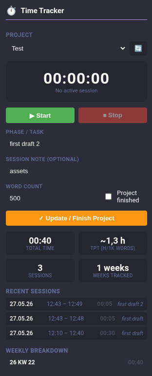

# Joplin Time Tracker with Frontmatter

A Joplin plugin for tracking time on writing projects with full YAML frontmatter support.

It is heavily inspired [Alon Diament's ](https://joplinapp.org/plugins/plugin/joplin.plugin.alondmnt.time-slip/?search=author%3D%22Alon%20Diament%22%20max-results%3D20) [Time Slip](https://github.com/alondmnt/joplin-plugin-time-slip) but adjusted for my personal needs as a writer - which mainly means it supports:
	- **frontmatter-overview queries** (it allows a YAML frontmatter to exist within the time-tracking note)
	- **automatically updates** YAML headers	
	- **automatically calculates** specific values

Track your writing sessions, see weekly breakdowns, calculate accumulated totals, and compute **time per thousand words (TpT)** — all stored directly in your note's frontmatter and markdown table.




---

## Features

- **Start/Stop timer** with phase labels (e.g., "first draft", "revision", "alpha read")
- **Project selector** — dropdown lists all notes tagged with your tracking tag (default: `timeTrack`)
- **Automatic calculations**: session duration, accumulated total, weekly totals, TpT
- **YAML frontmatter** writes all computed data: `time_total`, `hours_kwXX`, `note_kwXX`, `word_count`, `time_per_thousand`, `date_started`, `date_finished`, `current_phase`
- **Weekly breakdowns** — sessions grouped by calendar week (ISO 8601) with auto-generated summaries
- **Project finished checkbox** — sets `date_finished` in frontmatter
- **Word count tracking** with automatic TpT calculation
- **Dockable panel** — toggle from View menu or keep it visible in the sidebar
- **Recalculate command** — recalculate all data from the markdown table (Tools menu)
- **Customizable**: change tracking tag, week start day (Monday/Sunday), default phase
- **Compatible with `frontmatter-overview` plugin** — the master note query you requested works out-of-box
- Uses Joplin's native data API — no external services needed

---

## How It Works

### Note Structure 

> [!NOTE]
> The content of the note is created by the plugin once the project (timeTrack note) is selected.

Each tracked project is a Joplin note tagged with your tracking tag (default `timeTrack`). The note uses:

1. **YAML frontmatter** for computed fields:
   ```yaml
   ---
   title: My Story
   date_started: 15.05.26	 
   current_phase: first draft
   time_total: 12:30
   word_count: 5000
   time_per_thousand: 2.5
   hours_kw21: 08:00
   note_kw21: first draft
   hours_kw22: 04:30
   note_kw22: revision
   ---
   ```

2. **Markdown table** for session log:
   ```markdown
   | Day | Start | End | today [min] | Total Chapter [hour:min] (accum.) | Notes/Phase |
   | -------- | --- | --- | :---------: | :---: | --- |
   | 21.05.26 | 09:30 (Thursday) | 11:30 | 120 | 02:00 | first draft |
   | **WEEKLY Breakdown** <br>**26 KW 21** | | | **02:00** | | first draft |
   | 27.05.26 | 14:00 (Wednesday) | 16:30 | 150 | 04:30 | revision |
   ```

### Using the Panel

1. **Select a project** from the dropdown (lists all notes tagged with your tracking tag)
2. **Enter phase/task** (e.g., "first draft") and optional session note
3. Click **▶ Start** — the timer begins
4. Click **⏹ Stop** — session is logged, note is updated with all calculations
5. **Word Count** input updates `word_count` and recalculates TpT
6. Check **Project finished** and click **✓ Update / Finish** to set `date_finished`

### Menu Commands

- **View → Toggle Time Tracker panel** — show/hide the dockable panel
- **Tools → Recalculate Time Tracker data** — re-parse and recalculate everything from the current note's markdown table

---

## Installation

### From Source

1. Clone this repository
2. Run `npm install`
3. Run `npm run dist`
4. In Joplin: **Settings → Plugins → Advanced → Development plugins** — add the path to this plugin's directory
5. Restart Joplin

### From JPL (pre-built)

1. Download `io.arena.timetracker.jpl` from releases
2. In Joplin: **Settings → Plugins → Install from file**
3. Select the `.jpl` file

---

## Settings

Go to **Settings → Plugins → Time Tracker**:

| Setting | Default | Description |
|---------|---------|-------------|
| Tracking tag | `timeTrack` | The tag used to identify time-tracking notes |
| Start of week | Monday | Calendar week start for weekly breakdowns |
| Default phase | `first draft` | Pre-filled phase when starting a session |

---

## Integration with `frontmatter-overview`

The computed frontmatter fields work seamlessly with the [frontmatter-overview](https://github.com/Meisenburger13/joplin-frontmatter-overview) plugin. Create a master note that queries all your writing projects:

```markdown
# Writing Projects Overview

<!-- frontmatter-overview
query: tag:timeTrack
fields: title, current_phase, time_total, word_count, time_per_thousand
-->
```

This will render a table showing all your projects with their total times, word counts, and TpT values — all auto-calculated by Time Tracker.

---

## Development

```bash
npm install          # Install dependencies
npm run build        # Compile the plugin
npm run dev          # Watch mode for development
npm run dist         # Full build + JPL package
npm run updateVersion # Bump version number
```

### Project Structure

```
src/
  index.ts          — Plugin entry point, panel setup, message handlers
  settings.ts       — Settings registration & access
  timeUtils.ts      — Time parsing, formatting, calendar week calculations
  frontmatter.ts    — YAML frontmatter parsing & updating utilities
  noteManager.ts    — Note CRUD, session parsing, markdown table generation
  api.d.ts          — Type declarations for Joplin's api module
  ui/
    panel.css       — Panel styles (uses Joplin CSS variables for theming)
    panel.js        — Panel UI logic (webview message passing)
  manifest.json     — Plugin manifest
scripts/
  copyToDist.js     — Post-build JPL packaging
```

---
## DISCLAIMER

This is a personal project and nothing more. It was heavily supported by AI and the code has not been properly security tested or battle-proofed yet. <br>


## License

MIT
